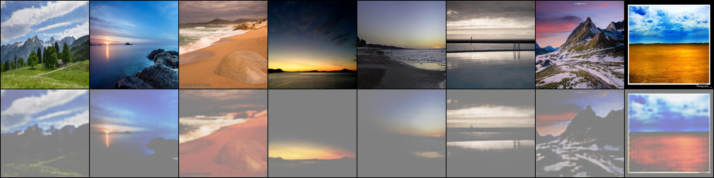
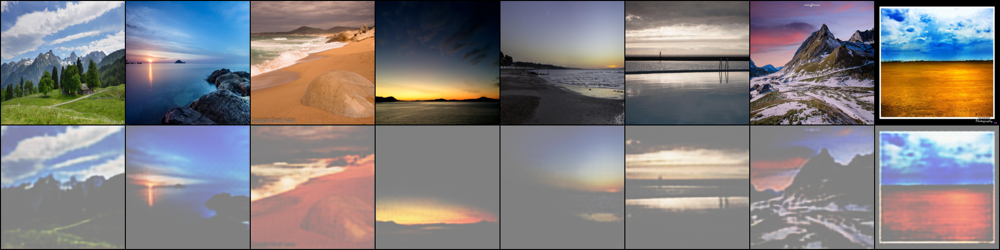
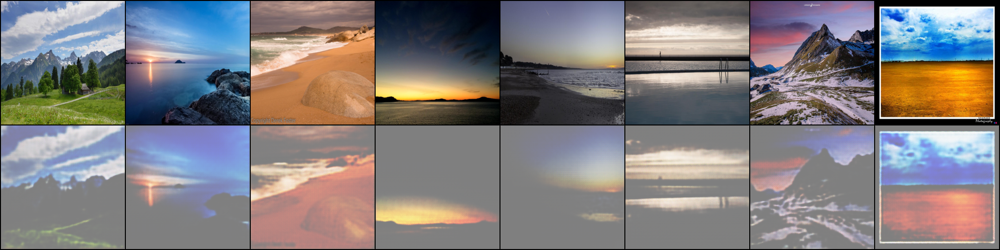
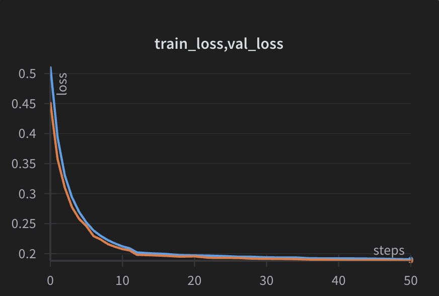

# Autoencoder for Landscape Image Reconstruction

This project implements a **convolutional autoencoder** trained to compress and reconstruct landscape images. The model learns a low-dimensional latent representation and aims to reconstruct the input images with minimal error.

## Dataset

The dataset used is [Landscape Pictures](https://www.kaggle.com/datasets/arnaud58/landscape-pictures) from Kaggle, containing high-resolution images of natural landscapes. All images were resized to **256x256** before training.

## Model Summary

- **Architecture**: Convolutional Autoencoder
- **Loss Function**: Mean Squared Error (MSE)
- **Optimizer**: Adam
- **Latent Dimension**: 16
- **Batch Size**: 128
- **Training Epochs**: 50

## Reconstructed Validation Images

Below are reconstructed validation samples at different training stages:

- **Epoch 23**  
  

- **Epoch 33**  
  

- **Epoch 50**  
  

Each image shows original inputs on top and corresponding reconstructions below.

## Loss Curve

Training loss over the course of training:

## Notes

- Reconstructions improved gradually as training progressed.
- The model successfully captures overall structure, colors, and layout of natural scenes.
- Slight blurring of fine textures is expected due to MSE optimization.

---

Let me know if you want to add encoder architecture diagrams, model weights, or interactive demo links.
