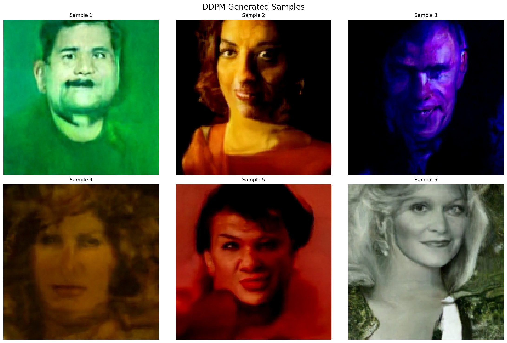

# Denoising Diffusion Probabilistic Models (DDPM) Implementation

This repository contains an implementation of the Denoising Diffusion Probabilistic Models (DDPM) from the paper ["Denoising Diffusion Probabilistic Models"](https://arxiv.org/abs/2006.11239) by Ho et al. (2020).

## Implementation Details

- Implemented the core DDPM framework for image generation
- Simplified the loss function to use only MSE (removed the second term from the original paper's loss function as it was found to be less relevant for this implementation)
- Training on CIFAR-10 dataset

## Sample Generations

Here are some generated samples from the model:



## Future Work

- Implement DDIM (Denoising Diffusion Implicit Models) sampling for faster generation
- Add exponential moving average (EMA) for model weights
- Implement FID (Fréchet Inception Distance) score calculation for quantitative evaluation
- Add LPIPS (Learned Perceptual Image Patch Similarity) loss for better perceptual quality

## Requirements

- Python 3.x
- PyTorch
- torchvision
- Other standard ML libraries (numpy, matplotlib, etc.)

## Usage

1. Install the required packages:
```bash
pip install -r requirements.txt
```

2. Train the model:
```bash
python train.py
```


