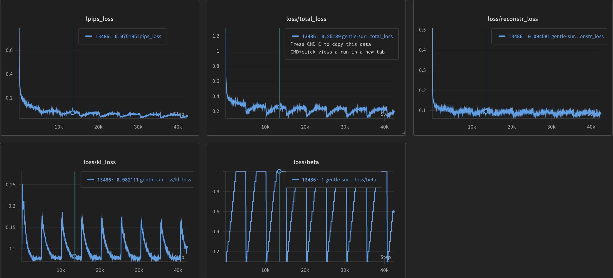

# Variational Autoencoder Experiments

This project explores different variants of Variational Autoencoders (VAEs) trained on an image dataset. The goal is to compare the reconstruction quality and latent representations learned under different VAE configurations.

## Models Trained

1. **Vanilla VAE**
   - Standard VAE with KL-divergence regularization.
   - Trained with default settings (β=1).

2. **β-VAE (β = 0.7)**
   - Encourages disentanglement by scaling the KL-divergence term.
   - Fixed β = 0.7 throughout training.

3. **Cyclically Annealed β-VAE**
   - β is gradually increased from 0 to 1 in cycles during training.
   - Allows the model to first focus on reconstruction, then gradually shift to learning disentangled latent representations.

---

## Reconstructed Images

| Model | Sample Reconstructions |
|-------|------------------------|
| **Vanilla VAE** |  |
| **β-VAE (β = 0.7)** |  |
| **Cyclic β-VAE** |  |  

## Loss Curve (Cyclic β-VAE)

---

---

## Notes

- All models were trained on the same dataset with identical architectures, differing only in the KL divergence weighting schedule.
- Cyclic β annealing proved useful in balancing reconstruction quality and latent structure learning.

---

## TODO

- Add t-SNE/UMAP plots of latent space.
- Quantitative metrics for all models.
- Interpolation and latent traversal visualizations.
