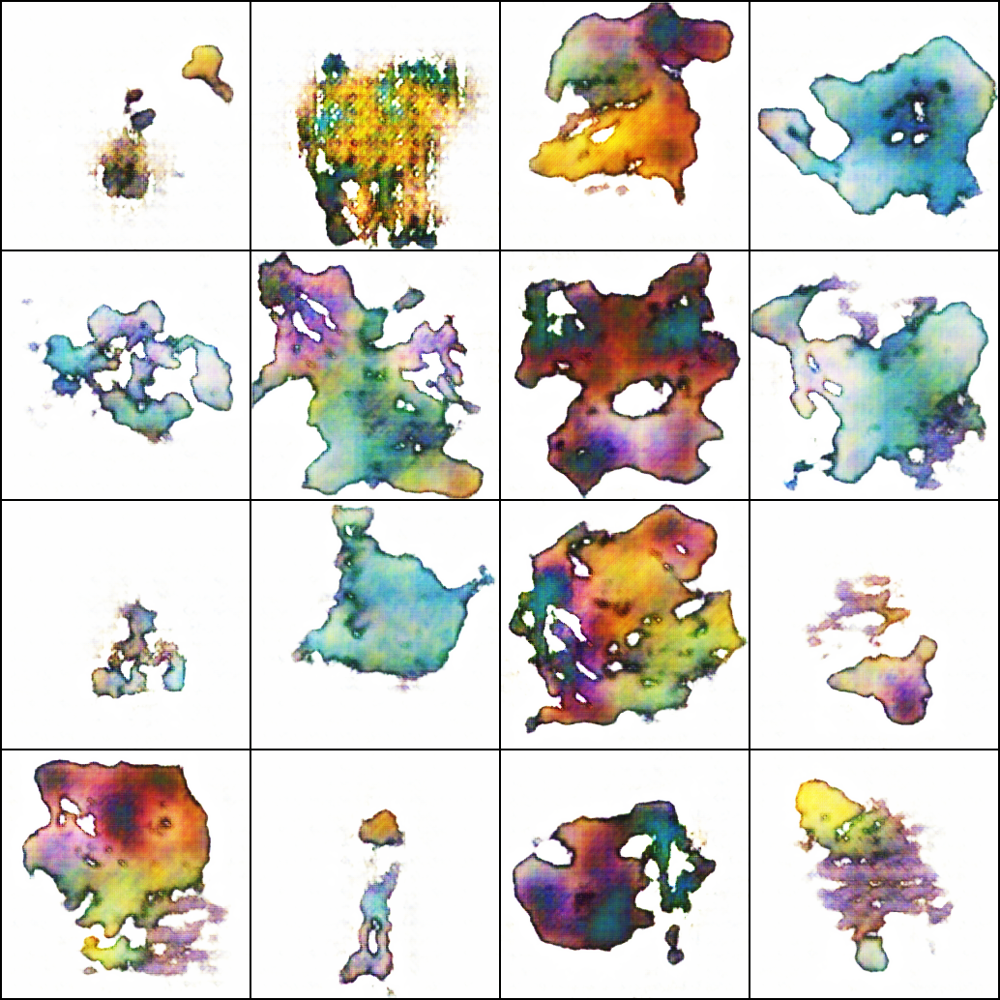
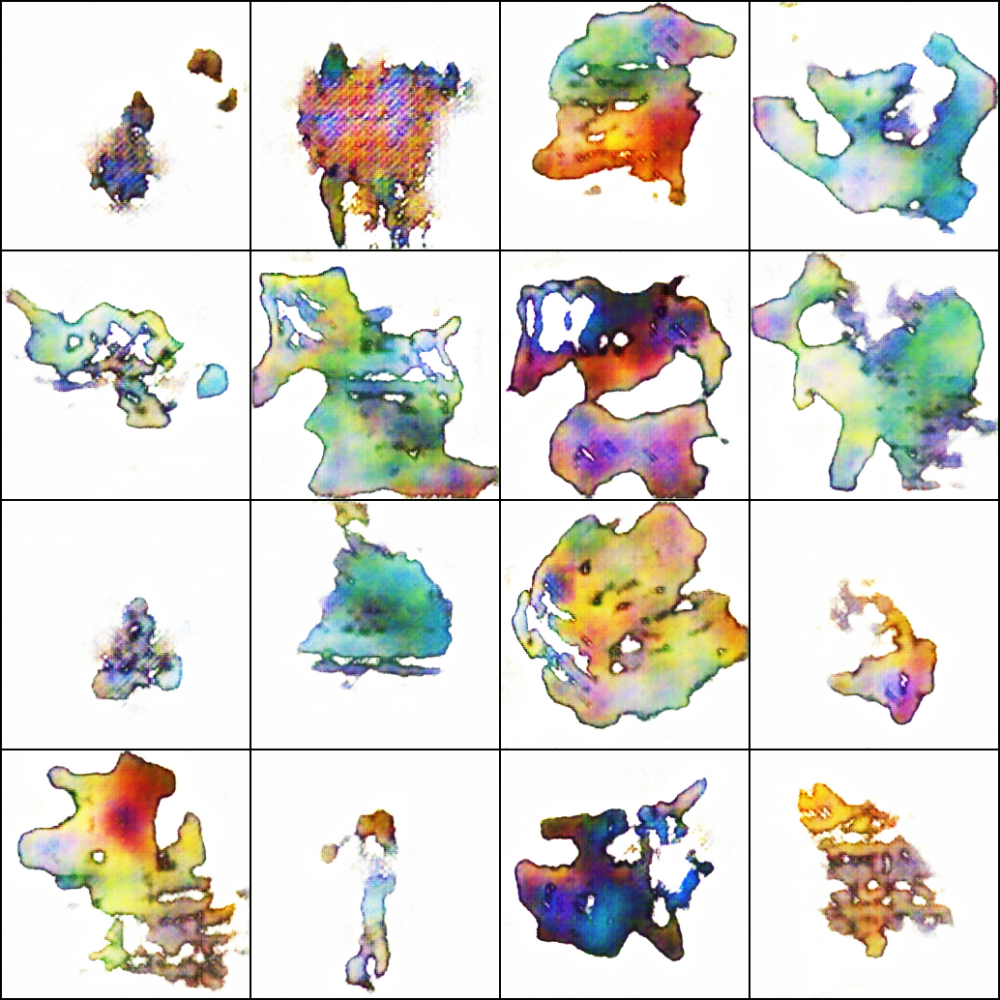
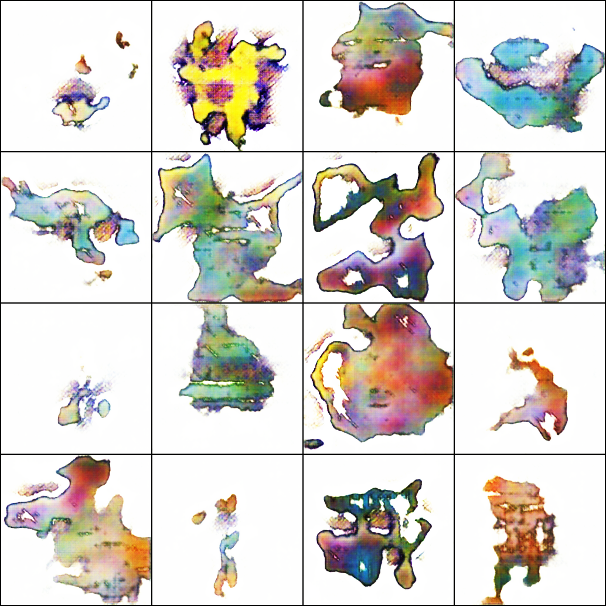
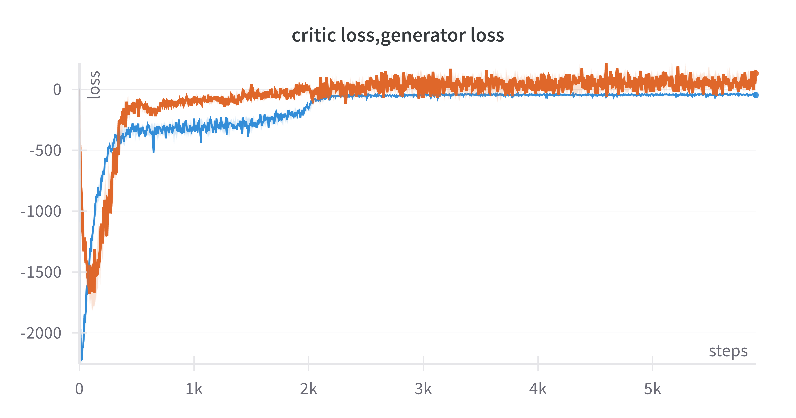

# WGAN Pokémon Image Generation

This project implements **Wasserstein GANs (WGANs)** to generate high-quality Pokémon images. Two WGAN variants were trained and compared:

- **WGAN with Weight Clipping**
- **WGAN with Gradient Penalty (WGAN-GP)**

Both models were trained on a curated Pokémon image dataset, resized to 256x256.

## Dataset

The dataset used is from [huggan/pokemon](https://huggingface.co/datasets/huggan/pokemon), containing high-quality images of various Pokémon characters.

## Models Trained

| Variant         | Regularization      | Description                              |
|----------------|---------------------|------------------------------------------|
| WGAN            | Weight Clipping     | Enforces Lipschitz constraint by clipping discriminator weights |
| WGAN-GP         | Gradient Penalty    | Uses a gradient penalty term instead of clipping for smoother training |

## Results

### Generated Pokémon Images

#### WGAN-GP

- **Epoch 60**  
  

- **Epoch 80**  
  

- **Epoch 100**  
  

### Loss Curves

#### WGAN-GP Loss

## Training Details

- Image size: **256x256**
- Optimizer: **Adam**
- Latent vector (z) size: **100**
- Discriminator updates per generator update: **5**
- Batch size: **64**
- Number of epochs: **100**

## Notes

- Weight clipping can lead to capacity underuse if the clip value is too small.
- Gradient penalty often yields more stable training and better quality images.

---

Feel free to adjust the image paths if your folder structure is different. Let me know if you also want to add FID scores or code snippets.
